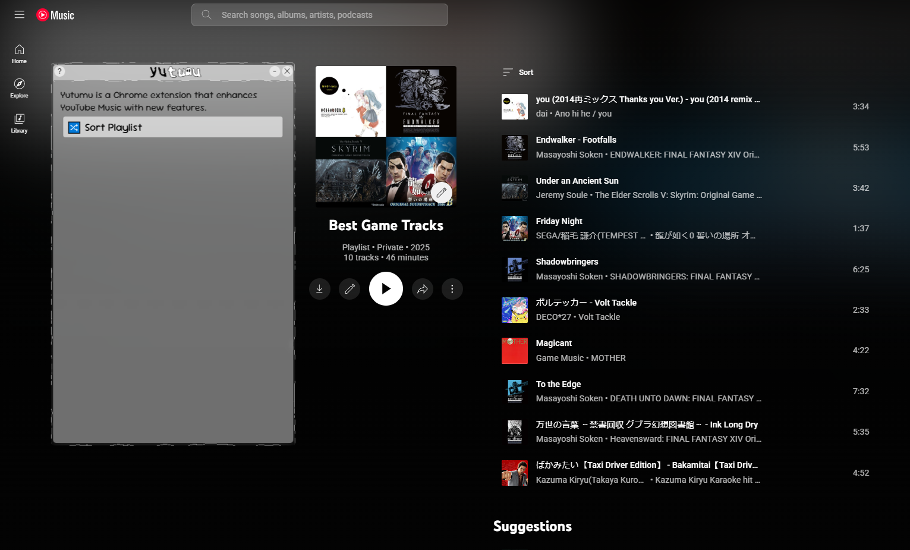
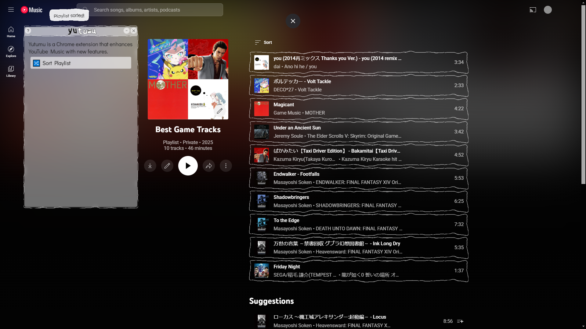
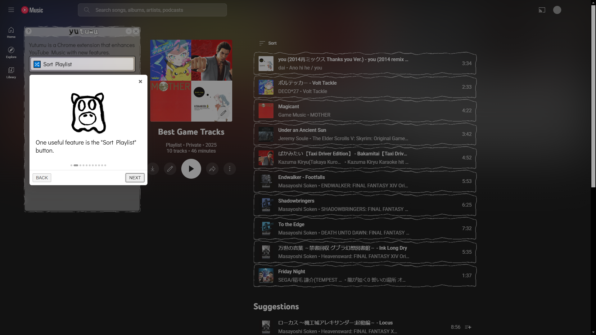

# Yutumu


[](https://github.com/RichardLitt/standard-readme)

Yutumu is a Chrome extension that enhances **YouTube Music** with features to simplify playlist management.

## Table of Contents

- [Background](#background)
- [Install](#install)
- [Usage](#usage)
- [Security](#security)
- [Roadmap](#roadmap)
- [Maintainers](#maintainers)
- [Thanks](#thanks)
- [Contributing](#contributing)
- [License](#license)

## Background

Yutumu was created to simplify **YouTube Music** playlist management. While I love YouTube Music and how it allows me to add various content (covers, remixes, instrumentals, etc.) to my playlists, the available sorting options (Manual, Newest First, Newest Last, as of March 2025) are limited. For users with large playlists, manually dragging and dropping hundreds of songs is **time-consuming** and **tedious**.

To address this, **Yutumu** introduces additional sorting options that can sort songs by artist, title, and length. The extension rearranges the songs in the **DOM**, and you then only need to drag and drop each song in-place to save the new ordering.

> **Note:** This is an **unofficial** extension and is *not* affiliated with or endorsed by YouTube or Google.

## Install

To add Yutumu to your Chrome browser as a local extension:

1. Clone or download the repository:
    ```sh
    git clone https://github.com/pacchiiru/yutumu.git
    cd yutumu
    ```
2. Install dependencies:
    ```sh
    npm install
    ```
3. Compile:
    ```sh
    npm run build
    ```
4. Open Google Chrome and visit the Extensions page by typing `chrome://extensions` in the address bar.
5. Enable **Developer mode** by toggling the switch at the top-right of the page.
6. Click the **Load unpacked** button at the top-left.
7. Select the generated **dist** folder within the Yutumu repository.
8. Yutumu will now appear in your list of Chrome extensions.


## Usage

1. Install the extension in Developer Mode (see [Install](#install)).
2. Visit any YouTube Music playlist page.
3. Drag the Yutumu panel by the titlebar to reposition it.
4. Drag the Yutumu panel by its edges to resize it.
5. Click the **❔** help button for help.
6. Click the **➖** minimize button to move the Yutumu panel out of the way.
7. Click the **✖** close button to close the Yutumu panel (can be reopened from the extension popup).
8. Click the **Sort Playlist** button to sort the playlist by one of the dropdown options.
9. Drag and drop each song in-place to save the new ordering (the border around the song will disappear).







## Security

Yutumu does **not** share, sell, or transmit your data to any external servers. If you have **any** concerns, **please do not install** the extension.

## Roadmap

Planned features include:

- **Playlist Analytics**
- **Playlist Export**
- **Playlist Filtering**
- **Playlist History / Versioning**
- **Playlist Sorting (Additional Options)**
- **Song Artist Lookup**
- **Song Lyrics Lookup**
- **Song Notes / Tags**
- **Song Rating**


## Maintainers

[@pacchiiru](https://github.com/pacchiiru)

## Thanks

Special thanks to:

- [interact.js](https://interactjs.io/)
- [Intro.js](https://introjs.com/)
- [Krita](https://krita.org/)
- [VOICEVOX:満別花丸](https://voicevox.hiroshiba.jp/)
- [YouTube Music](https://music.youtube.com/)


## Contributing

Not accepting contributions for now. Thank you for your interest and support.

## License

MIT License

Copyright (c) 2025 pacchiiru

Permission is hereby granted, free of charge, to any person obtaining a copy
of this software and associated documentation files (the "Software"), to deal
in the Software without restriction, including without limitation the rights
to use, copy, modify, merge, publish, distribute, sublicense, and/or sell
copies of the Software, and to permit persons to whom the Software is
furnished to do so, subject to the following conditions:

The above copyright notice and this permission notice shall be included in all
copies or substantial portions of the Software.

THE SOFTWARE IS PROVIDED "AS IS", WITHOUT WARRANTY OF ANY KIND, EXPRESS OR
IMPLIED, INCLUDING BUT NOT LIMITED TO THE WARRANTIES OF MERCHANTABILITY,
FITNESS FOR A PARTICULAR PURPOSE AND NONINFRINGEMENT. IN NO EVENT SHALL THE
AUTHORS OR COPYRIGHT HOLDERS BE LIABLE FOR ANY CLAIM, DAMAGES OR OTHER
LIABILITY, WHETHER IN AN ACTION OF CONTRACT, TORT OR OTHERWISE, ARISING FROM,
OUT OF OR IN CONNECTION WITH THE SOFTWARE OR THE USE OR OTHER DEALINGS IN THE
SOFTWARE.