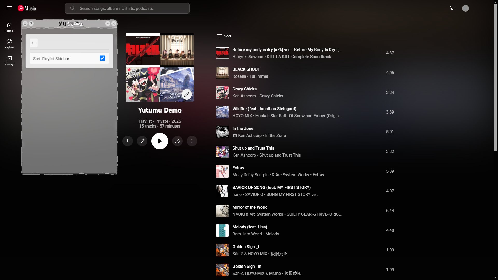
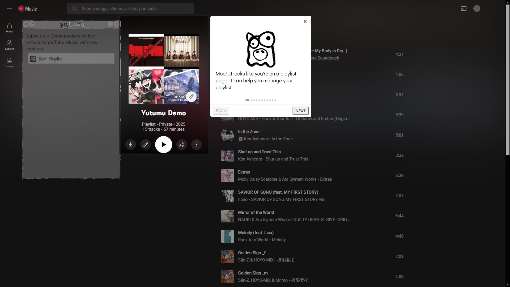

# Yutumu


[](https://github.com/RichardLitt/standard-readme)

Yutumu is a Chrome extension that enhances **YouTube Music** with features to simplify playlist management.

## Table of Contents

- [Background](#background)
- [Install](#install)
- [Usage](#usage)
- [Security](#security)
- [Roadmap](#roadmap)
- [Maintainers](#maintainers)
- [Thanks](#thanks)
- [Contributing](#contributing)
- [License](#license)

## Background

**Yutumu** streamlines playlist management on **YouTube Music**. While YouTube Music is awesome for letting users save a variety of YouTube-exclusive content into playlists, such as covers, remixes, and instrumentals, its built-in management tools are somewhat limited.

Take sorting, for example. As of February 2025, YouTube Music offers only three sorting options: Manual, Newest first, and Newest last. For users with extensive playlists, manually rearranging hundreds of songs to achieve a different order (like alphabetical) can be both **time-consuming** and **tedious**.

To overcome this limitation, **Yutumu** introduces advanced sorting features that allow you to organize songs by artist, title, or length. The extension automatically reorders the songs in the **DOM**, so you only need to drag and drop each track to finalize the new arrangement.

For a comprehensive overview of Yutumu’s vision, please see our [Roadmap](#roadmap).

> **Note:** This is an **unofficial** extension and is *not* affiliated with or endorsed by YouTube or Google.

## Install

To add Yutumu to your Chrome browser as a local extension:

1. Clone or download the repository:
    ```sh
    git clone https://github.com/pacchiiru/yutumu.git
    cd yutumu
    ```
2. Install dependencies:
    ```sh
    npm install
    ```
3. Compile:
    ```sh
    npm run build
    ```
4. Open Google Chrome and visit the Extensions page by typing `chrome://extensions` in the address bar.
5. Enable **Developer mode** by toggling the switch at the top-right of the page.
6. Click the **Load unpacked** button at the top-left.
7. Select the generated **dist** folder within the Yutumu repository.
8. Yutumu will now appear in your list of Chrome extensions.


## Usage

1. Install the extension in Developer Mode (see [Install](#install)).
2. Visit any YouTube Music playlist page.
3. Drag the Yutumu panel by the titlebar to reposition it.
4. Drag the Yutumu panel by its edges to resize it.
5. Click the **⚙** Settings button to change various settings and smaller page features.
6. Click the **❔** Help button for help.
7. Click the **➖** Minimize button to move the Yutumu panel out of the way.
8. Click the **✖** Close button to close the Yutumu panel (can be reopened from the extension popup).
9. Click the **Sort Playlist** button to sort the playlist by one of the dropdown options.
10. Drag and drop each song in-place to save the new ordering (the border around the song will disappear).






## Security

Yutumu does **not** share, sell, or transmit your data to any external servers. If you have **any** concerns, **please do not install** the extension.

## Roadmap

Planned features include:

- **Song Badges, Notes, Ratings, Tags**
  - **Idea:** Allow users to add custom badges, notes, and tags to songs, displaying them alongside each song
  - **Badge:** A single icon to signify something about a song, displayed next to it
  - **Note:** A "sticky note" icon that, when clicked or hovered over, opens a textarea for adding or displaying notes for a specific song
  - **Rating:** Allow users to rate a song from 1 to 10
  - **Tag:** Similar to a badge, but a single word displayed next to the song
  - **Built-in badges will include:**
    - Indicate if a song is already in one of your playlists
    - Indicate if a song is by an artist tagged as a favorite
  - Add song badges, notes, ratings, and tags in bulk
    - Redo and undo
- **Song Lyrics Lookup**
  - Explore options for implementation
- **Artist Lookup**
  - May simply pull up a Wikipedia page
  - Explore additional implementation options
- **Artist Badges, Tags**
  - Tag artists into specific groups (e.g., "Favorites")
- **Playlist Analytics**
  - Provide stats and charts
  - Simplest Examples: number of playlists, number of songs in playlists, number of unique artists, etc.
- **Playlist Export**
  - Export all playlist and song information to CSV, etc.
- **Playlist History, Versioning**
  - Option for periodic auto-saving of playlists
  - View previously saved versions (e.g., to check for a specific song that was removed)
- **Playlist Search**
  - Search specific playlist, or all playlists by artist, song title, album, etc.
- **Additional Playlist Sorting Options**
  - Sort by album
  - Sort by badge
  - Sort by rating
  - Sort by tag
  - User-defined sorting orders (e.g., song tag, then song artist, then song title)
- **Help & Tutorials**
  - Integrate Intro.js guided tours accessible through the help button


## Maintainers

[@pacchiiru](https://github.com/pacchiiru)

## Thanks

Special thanks to:

- [interact.js](https://interactjs.io/)
- [Intro.js](https://introjs.com/)
- [Krita](https://krita.org/)
- [VOICEVOX:満別花丸](https://voicevox.hiroshiba.jp/)
- [YouTube Music](https://music.youtube.com/)


## Contributing

Not accepting contributions for now. Thank you for your interest and support.

## License

MIT License

Copyright (c) 2025 pacchiiru

Permission is hereby granted, free of charge, to any person obtaining a copy
of this software and associated documentation files (the "Software"), to deal
in the Software without restriction, including without limitation the rights
to use, copy, modify, merge, publish, distribute, sublicense, and/or sell
copies of the Software, and to permit persons to whom the Software is
furnished to do so, subject to the following conditions:

The above copyright notice and this permission notice shall be included in all
copies or substantial portions of the Software.

THE SOFTWARE IS PROVIDED "AS IS", WITHOUT WARRANTY OF ANY KIND, EXPRESS OR
IMPLIED, INCLUDING BUT NOT LIMITED TO THE WARRANTIES OF MERCHANTABILITY,
FITNESS FOR A PARTICULAR PURPOSE AND NONINFRINGEMENT. IN NO EVENT SHALL THE
AUTHORS OR COPYRIGHT HOLDERS BE LIABLE FOR ANY CLAIM, DAMAGES OR OTHER
LIABILITY, WHETHER IN AN ACTION OF CONTRACT, TORT OR OTHERWISE, ARISING FROM,
OUT OF OR IN CONNECTION WITH THE SOFTWARE OR THE USE OR OTHER DEALINGS IN THE
SOFTWARE.